# Task 02 - Configure Azure resources

## Introduction

Now that you have deployed the necessary Azure resources, the next step is to configure these resources.

## Description

In this task, you will configure your Microsoft Foundry project and set up the necessary environment variables for your application.

## Success Criteria

- You have configured your Microsoft Foundry project.
- You have set up the necessary environment variables for your application in a .env file.

## Learning Resources

- [What is Microsoft Foundry?](https://learn.microsoft.com/azure/ai-foundry/what-is-azure-ai-foundry)
- [Add a new connection to your project](https://learn.microsoft.com/azure/ai-foundry/how-to/connections-add)
- [How to create and configure your storage account for use in Microsoft Foundry Projects](https://learn.microsoft.com/azure/ai-foundry/how-to/evaluations-storage-account)

## Key Tasks

### 01: Create Azure AI model deployments

The Microsoft Foundry project that you deployed as part of the first step is now ready to be configured. You will need to set up the project to use the resources that you deployed in the previous step, as well as selecting the model deployments that you will use.

<strong>Expand this section to view the solution</strong>

Navigate to the [Microsoft Foundry](https://ai.azure.com/) and select the project that you created in the prior task.

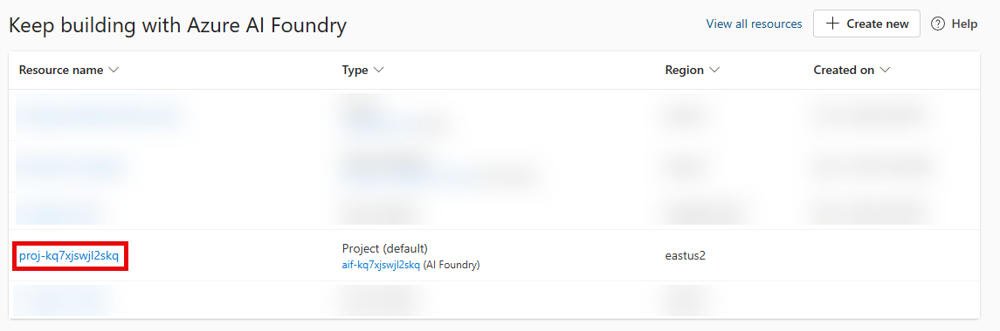

From the **Build** menu, select **Models** from the list. Then, select the **Deploy a base model**.

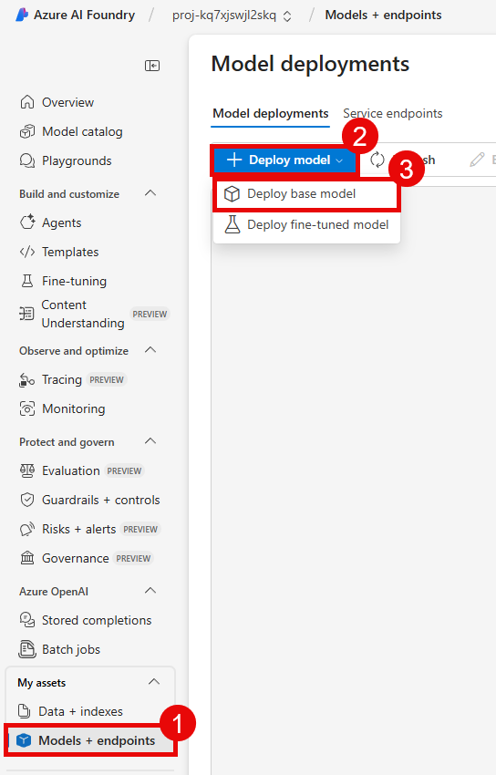

On the **Models** page, enter `phi-4` in the search box and select the **Phi-4** model from the list. Then, select **Confirm** to create a Phi-4 deployment in your project.

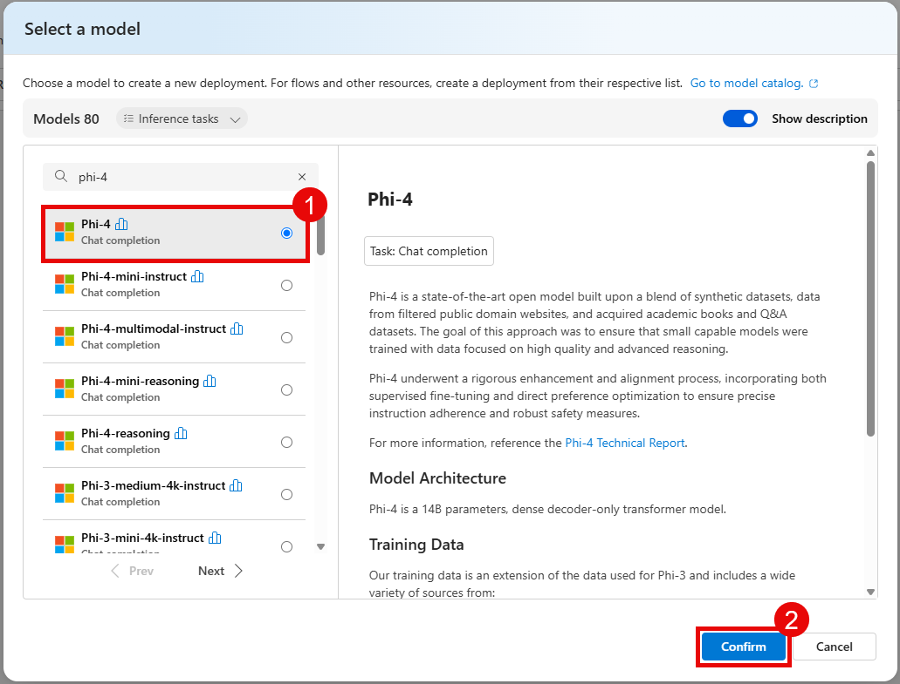

Select the **Deploy** button and then choose **Default settings**. On the modal dialog, select **Agree and proceed** to deploy the model.

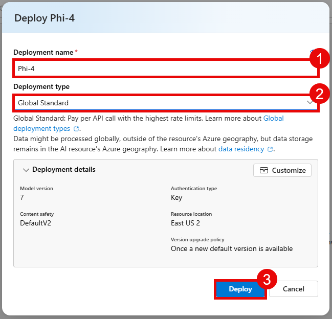

Repeat this process for **gpt-5-mini** and **text-embedding-3-large**. You will have three model deployments in total.

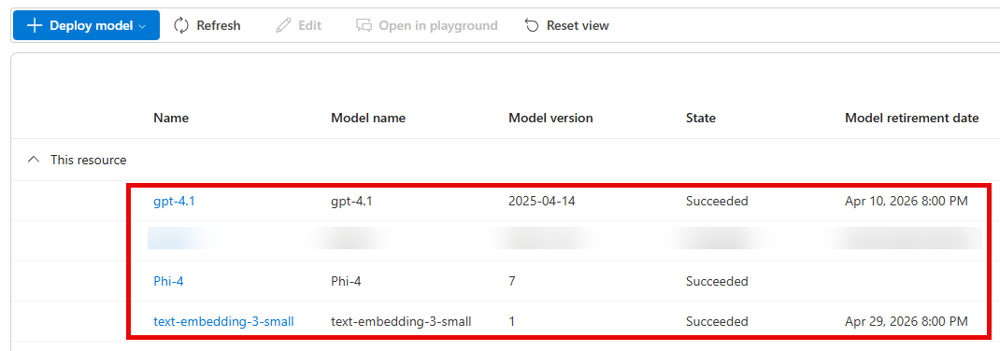

### 02: Connect resources to your Microsoft Foundry project

The next step is to connect the resources that you deployed in the prior task to your Microsoft Foundry project. This includes connecting the storage account, Cosmos DB, and Application Insights resource that you created in the first task.

<strong>Expand this section to view the solution</strong>

In your Microsoft Foundry project, select the **Discover** menu and then choose **Tools** from the left-hand side.

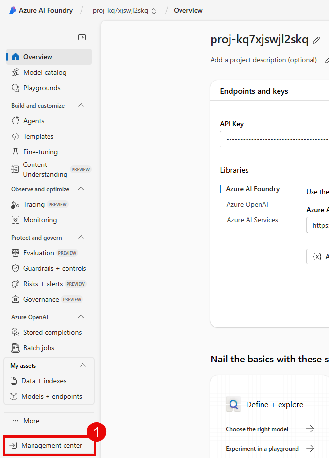

In the search box, enter `blob storage`. Select the **Azure Blob Storage** entry.

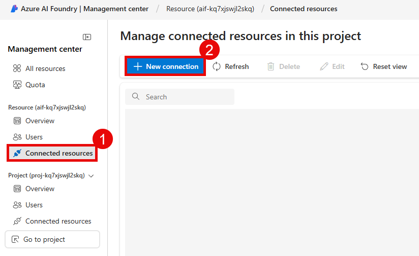

On the **Azure Blob Storage** page, ensure that the authentication type is **Managed identity** and then select **Connect**.

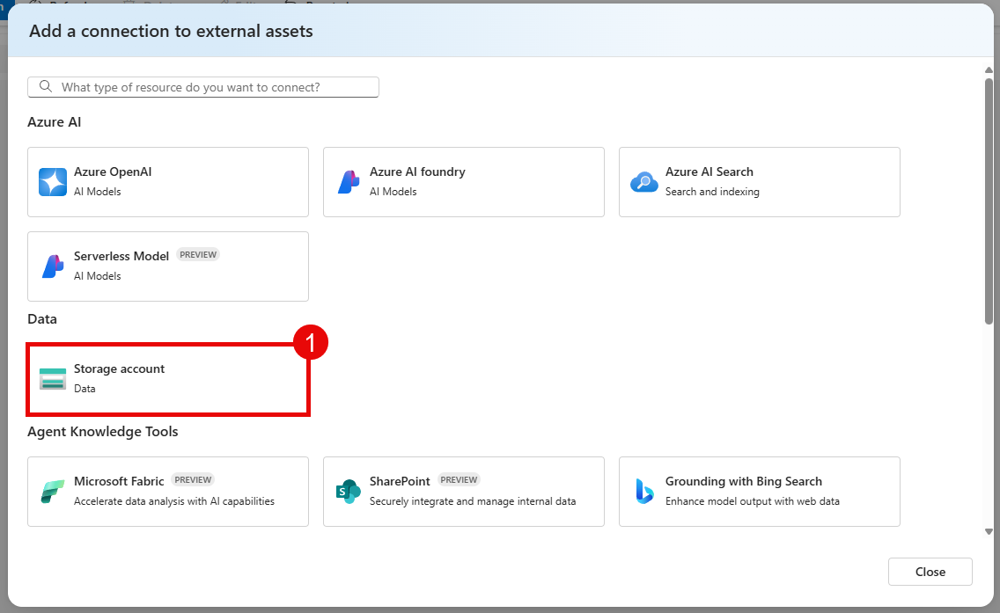

This will require the creation of a Logic Apps resource. Change the name if you wish and then select **Create a Logic Apps resource**. Note that this will may several minutes to complete.

Once the Logic Apps resource has been created, a dialog will appear. Select **Select all** to give the MCP server all relevant actions. Then, select **Next (15 selected)** to continue.

Then, in the **Create connection** tab, change the **connection name** to `StorageAccountConnection` and choose **Logic Apps Managed Identity** for the authentication type. Select **Create new** to create the connection.

Select **Save** to complete the connector wizard.

On the **Register an MCP server with Azure Logic Apps** page, provide an MCP server name, such as `zavamcpstorage`. The name must contain only letters and numbers. For the description, enter a value such as `Zava MCP Server used for interacting with Azure Blob Storage.` Then, select **Register** to complete this registration.

This will redirect you to the Azure portal. Return to [Microsoft Foundry](https://ai.azure.com/) and your project. Then, return to the **Discover** menu and select **Tools**. Enter `cosmos db` into the search box and select the **Custom** version of **Azure Cosmos DB**.

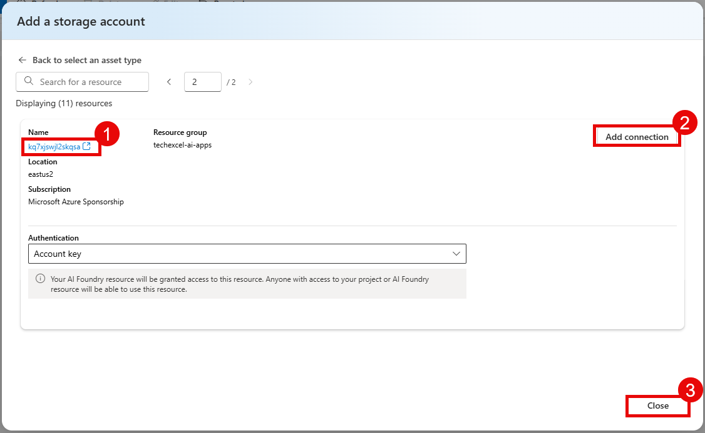

Select **Connect** and this will take you to the registration page. On the **Add actions** page, select the options to get a document, get all documents, and query documents. Then, choose **Next (3 selected)**.

In the **Create connection** tab, change the **connection name** to `CosmosDBConnection` and choose **Logic Apps Managed Identity** for the authentication type. Select **Create new** to create the connection. Select **Save** to save these changes.

On the **Register an MCP server with Azure Logic Apps** page, provide an MCP server name, such as `zavamcpcosmos`. The name must contain only letters and numbers. For the description, enter a value such as `Zava MCP Server used for interacting with Cosmos DB.` Then, select **Register** to complete this registration.

This will redirect you to the Azure portal. Return to [Microsoft Foundry](https://ai.azure.com/) and your project. Then, return to the **Discover** menu and select **Tools**. Enter `application insights` into the search box and select **Azure Application Insights**.

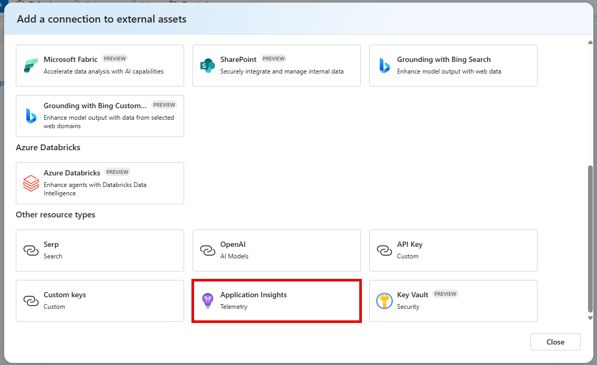

Select **Connect** and then choose both of the Application Insights actions before selecting the **Next** button.

On the **Create connection** tab, name the connection `AppInsightsConnection`. From there, you will need to provide an application ID and API key. To do so, first open a new browser tab and navigate to the [Azure portal](https://portal.azure.com). Navigate to the Application Insights resource created in your resource group. In the **Configure** menu, select **API Access**. Then, select the **+ Create API key** option to create a new API key.

On the **Create API key** page, enter a description such as `Connect to Application Insights for Zava MCP Server`. Select all available API permissions and then choose **Generate key**.

Copy the resulting key to a text editor and then select the **X** in the top-right corner of the page to close this menu. On the API Access menu, copy the **Application ID** to a text editor.

Return to the browser tab you used to register an MCP server with Azure Logic Apps. Fill in the values for **Application Id** and **API Key**, then select **Create new**.

Select **Save** to complete the connection. For the **MCP server name**, enter `zavamcpinsights` and enter `Zava MCP Server used for interacting with Application Insights.` for the description. Finally, select **Register** to complete registration.

### 03: Grant storage account permissions

Now that you have connected a storage account to your Microsoft Foundry project, you will need to grant the project permission to access the storage account. You will also need to grant your own user account permission to access the storage account so that you can run the code in this training.

<strong>Expand this section to view the solution</strong>

In the [Azure portal](https://portal.azure.com/), navigate to the storage account that you connected to your Microsoft Foundry project in the previous step.

Select the **Access control (IAM)** option from the left-hand menu. Then, select the **+ Add** button and choose **Add role assignment**.

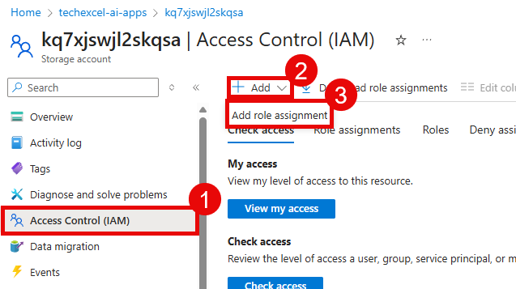

Choose the **Storage Blob Data Contributor** role from the **Job function roles** list. Then, select **Members**.

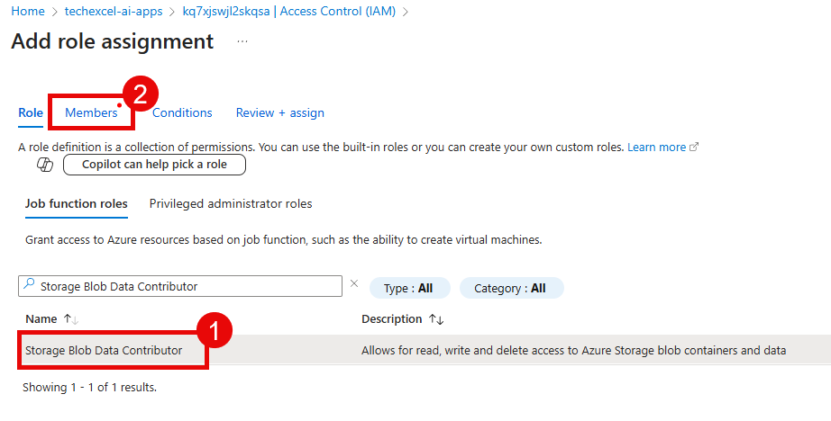

Select the **Managed identity** radio button and then choose **+ Select members**.

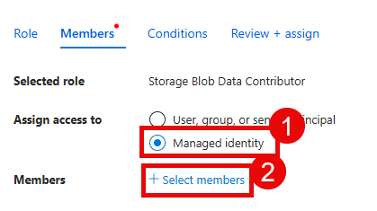

In the flyout pane, ensure your subscription is selected. Then, select **Foundry project** (previously known as **Azure AI Foundry project**) from the **Managed identity** drop-down list. Choose the Microsoft Foundry project associated with this training and then select the **Select** button at the bottom of the pane. This must be the project and not the Microsoft Foundry resource itself.

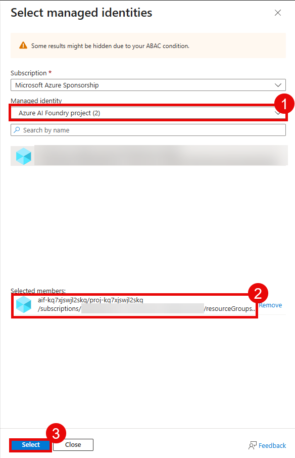

After adding the managed identity, select **User, group, or service principal** from the **Select members** pane. Then, search for your own user account and select it from the list. Finally, select the **Select** button at the bottom of the pane.

When you are back on the **Add role assignment** pane, select the **Review + assign** button twice to grant both the managed identity for your Microsoft Foundry project and your own user account the Storage Blob Data Contributor role on this storage account.
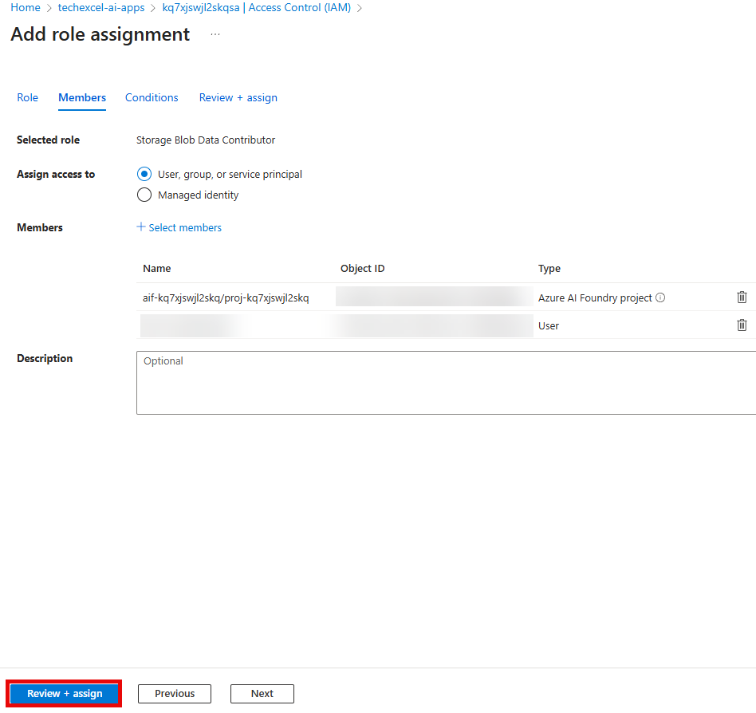

### 04: Create .env file

In order to run the code in this training, you will need to create a `.env` file in the `src` directory of the repository that you cloned in the first task. This file will contain the necessary environment variables for your application to connect to the Azure resources that you deployed and configured in the previous tasks. Use the file `src/env_sample.txt` as a template for creating your `.env` file.

<strong>Expand this section to view the solution</strong>

Copy the file `src/env_sample.txt` to a new file named `.env` in the same directory. Then, open the `.env` file in a text editor and update the values for each environment variable to match your Azure resources. For any environment variables with pre-filled values, you can leave them as they are unless you explicitly changed the names of the resources during deployment.

You will find many of these variables in the Microsoft Foundry project that you created. To find these values, start by navigating to the **Home** page.

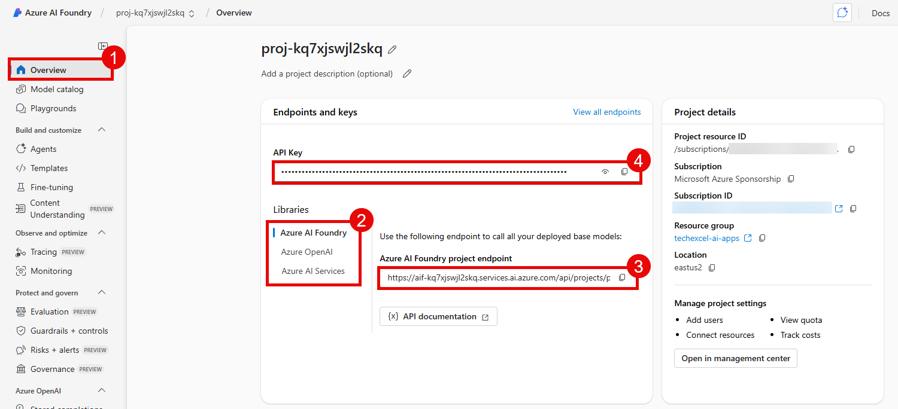

Then, fill in the following.

- `FOUNDRY_ENDPOINT`: Copy the **Project endpoint** box.
- `FOUNDRY_KEY`: Copy the **Project API Key** box.

For the following variables, navigate to the ***Models** menu option from the **Build** menu.

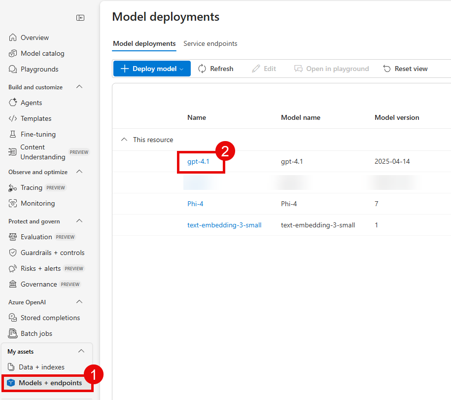

Then, select the appropriate model deployment that you created in the previous step and navigate to the **Details** tab in order to fill in the details below.

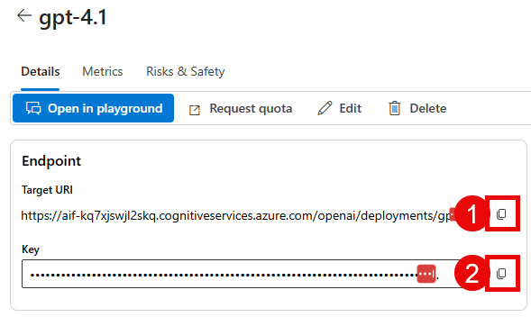

- `gpt_endpoint`: Copy the **Target URI** box from the **gpt-5-mini** deployment and save everything prior to `/openai` in the URI. It should look something like `https://{YOUR_AI_FOUNDRY}.cognitiveservices.azure.com/`.
- `gpt_api_key`: Copy the **Key** box from the **gpt-5-mini** deployment.

Repeat this process to collect the text-embedding-3-large endpoint details:

- `embedding_endpoint`: Copy the **Target URI** box from the **text-embedding-3-large** deployment. You can copy and paste the entire URL for this endpoint.
- `embedding_api_key`: Copy the **Key** box from the **text-embedding-3-large** deployment.

Repeat this process to collect the Phi-4 endpoint details, with one major exception.

- `phi_4_endpoint`: Use the following URL, populating the value of your Microsoft Foundry name for `{YOUR_AI_FOUNDRY}`: `https://{YOUR_AI_FOUNDRY}.services.ai.azure.com/models`.
- `phi_4_api_key`: Copy the **Key** box from the **Phi-4** deployment.

For the following variables, navigate to the [Azure Portal](https://portal.azure.com/) and open the storage account that you created in the first task. Then, navigate to the **Access keys** option from the **Security + networking** menu on the left-hand side.

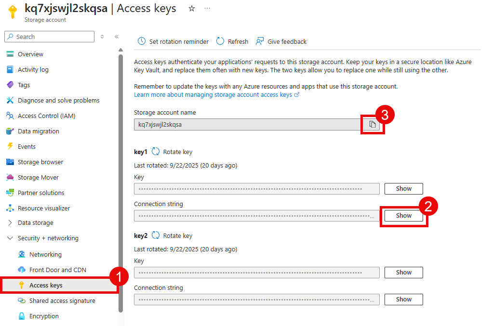

- `blob_connection_string`: Copy the value for **Connection string** from the **key1** section.
- `storage_account_name`: Copy the value for **Storage account name**.

{: .note }
> The `blob_connection_string` variable is used as a fallback in case your managed identity access does not work. Otherwise, it will not be used in this training.

To fill in the Cosmos DB variables, navigate to the Cosmos DB account that you created in the first task.

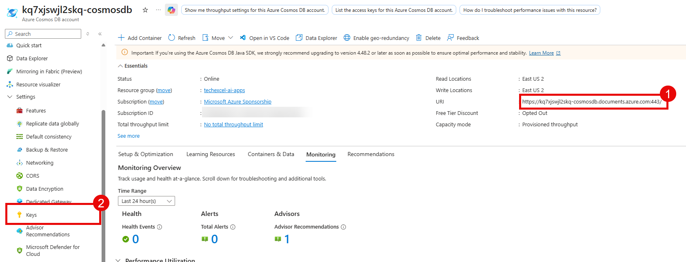

- `COSMOS_ENDPOINT`: Copy the value for **URI** from the **Overview** page.
- `COSMOS_KEY`: Copy the value for **PRIMARY KEY** from the **Keys** page in the **Settings** menu.

{: .note }
> The `COSMOS_KEY` variable is used as a fallback in case your managed identity access does not work. Otherwise, it will not be used in this training.

For the following variable, navigate to the Application Insights resource that you created in the first task.

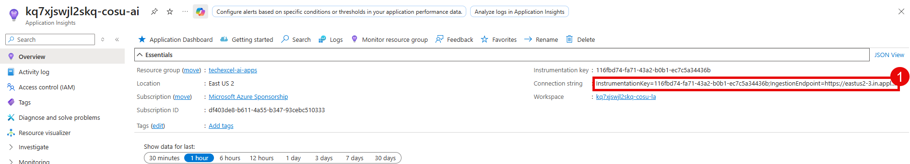

- `APPLICATIONINSIGHTS_CONNECTION_STRING`: Copy the value for **Connection string** from the **Overview** page.

{: .note }
> The .env file also includes placeholders for an MCP server location and agent IDs. You will fill these in during Exercise 2.

