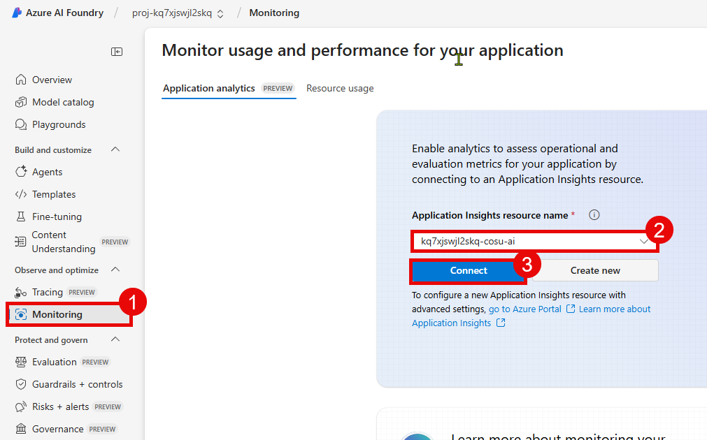
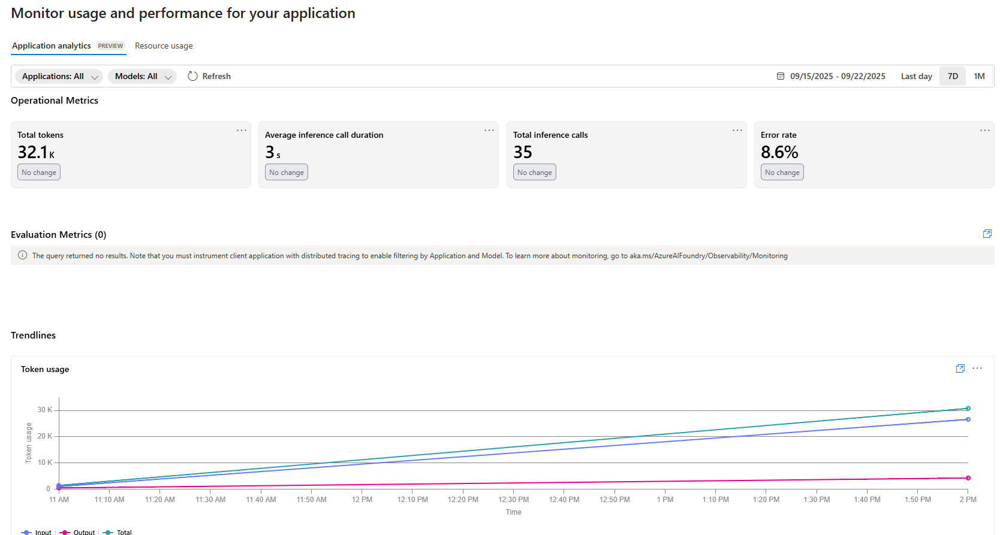

# Task 01 - Review the AI Foundry Application analytics dashboard

## Introduction

Zava has an application up and running. They would like to monitor the performance and usage of their deployed AI models to ensure they are functioning as expected and to identify any potential issues. To assist with this, Azure AI Foundry provides built-in observability features that allow you to track model performance, usage metrics, and errors. In addition, Azure Monitor and Application Insights can be integrated with AI Foundry to provide deeper insights into model behavior and application performance. This will help Zava ensure that their multimodal AI shopping assistant is reliable and performs well for their customers.

## Description

In this task, you will review the AI Foundry Application analytics dashboard to monitor the performance and usage of your deployed AI models. You will explore the various metrics and visualizations available in the dashboard, which can help you understand how your models are being used and identify any potential issues.

## Success Criteria

- You have enabled monitoring capabilities in Azure AI Foundry.
- You have reviewed the AI Foundry Application analytics dashboard.

## Learning Resources

- [Observability in generative AI](https://learn.microsoft.com/azure/ai-foundry/concepts/observability)
- [Monitor your generative AI applications](https://learn.microsoft.com/azure/ai-foundry/how-to/monitor-applications)

## Key Tasks

### 01: Enable monitoring capabilities in Azure AI Foundry

To begin using the Application analytics dashboard, you will first need to ensure that monitoring capabilities are enabled in your Azure AI Foundry project. This involves connecting an Application Insights resource to your AI Foundry project if you have not already done so in Exercise 01.

<details markdown="block">
<summary><strong>Expand this section to view the solution</strong></summary>

First, navigate to [Azure AI Foundry](https://ai.azure.com) and select the AI project associated with this training. Then, select **Monitoring** from the **Observe and optimize** menu on the left-hand side.

Ensure that you are in the **Application analytics** tab. If you have not already connected an Application Insights resource, you can do so by selecting the Application Insights resource associated with this TechWorkshop L300 from the drop-down menu. Then, select **Connect** to enable monitoring.



After connecting your Application Insights resource to the Azure AI Foundry project, you will be able to see a set of default metrics associated with your deployed models. These metrics include token utilization, latency, request counts, and error rates.

</details>

### 02: Instrument the client application

Some of the metrics available on the Application analytics dashboard are based on telemetry data sent from your client application. To ensure that your application is properly instrumented, you will need to add the Application Insights SDK to your application code. The sample chat application already includes these instrumented capabilities. To verify that the application is properly instrumented, you can review the `chat_app.py` file in the `src` directory.

**Lines 58-59** of the `chat_app.py` file include the necessary import statements for the OpenTelemetry and Azure Monitor SDKs. The `configure_azure_monitor()` function is called on **line 59**, which enables telemetry collection for the application.

```python
application_insights_connection_string = os.environ["APPLICATIONINSIGHTS_CONNECTION_STRING"]
configure_azure_monitor(connection_string=application_insights_connection_string)
```

You can also see the `configure_azure_monitor()` function call in two other files: `agent_processor.py` and `discountLogic.py`. This ensures that telemetry is collected for operations that occur within these files as well.

### 03: Review default application metrics

Now that you have enabled monitoring capabilities in your Azure AI Foundry project and verified that your client application is properly instrumented, you can review the default application metrics available in the Application analytics dashboard.

<details markdown="block">
<summary><strong>Expand this section to view solution</strong></summary>

First, navigate to [Azure AI Foundry](https://ai.azure.com) and select the AI project associated with this training. Then, select **Monitoring** from the **Observe and optimize** menu on the left-hand side.

Ensure that you are in the **Application analytics** tab. Here, you will see a variety of metrics related to your deployed models, including:

- Total number of tokens used
- Average duration of an inference operation
- Total number of inference requests
- Percentage of requests with errors



Additionally, there are charts that visualize these metrics over time, allowing you to identify trends and patterns in model usage. In the **Applications** menu at the top of the screen, you can select the specific application that you want to monitor. If you have deployed the sample chat application to Azure App Services, you should see it listed here. In addition, there will be a default application named `unknown_service` that represents the requests you have run locally.

Next to the **Applications** menu is a **Models** menu. This will allow you to filter the metrics by specific model deployments. You should see the `gpt-4o` deployment that you created in Exercise 01 listed here, as well as `phi4` for Cora.

These metrics will help you understand the performance and usage patterns of your AI models, allowing you to make informed decisions about optimizations and improvements.

{: .note }
> There are additional metrics available in the **Application analytics** tab if you have instrumented your code to track specific evaluation events. The code in this training does not include this additional instrumentation, but you can learn more about how to add it by reviewing the [Monitor your generative AI applications](https://learn.microsoft.com/azure/ai-foundry/how-to/monitor-applications) documentation.

</details>
