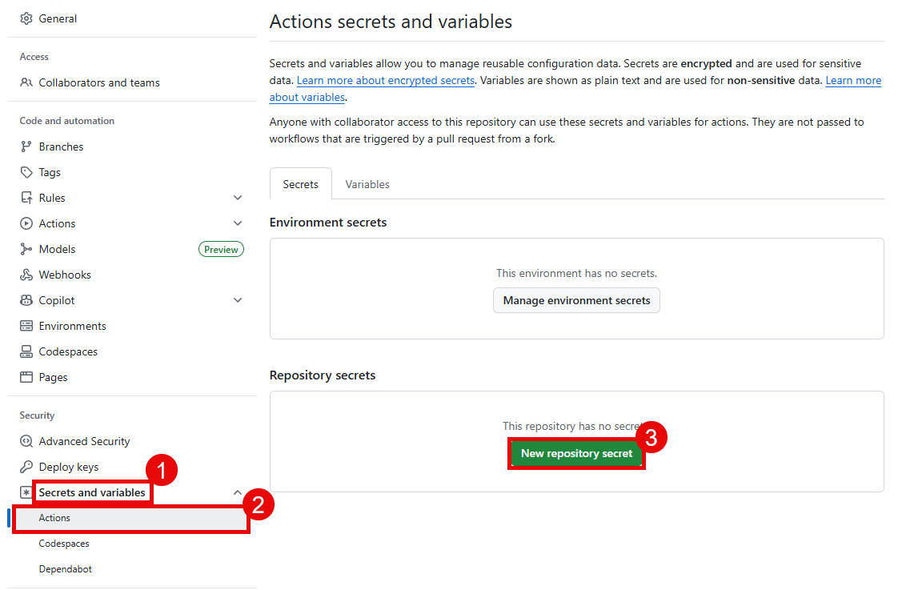
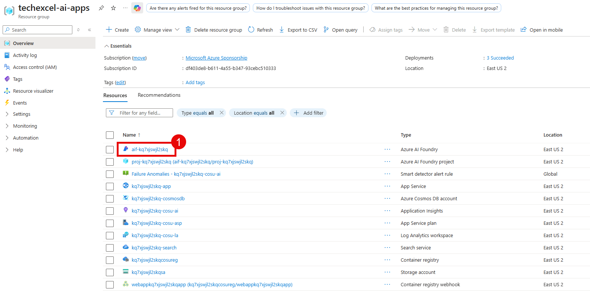
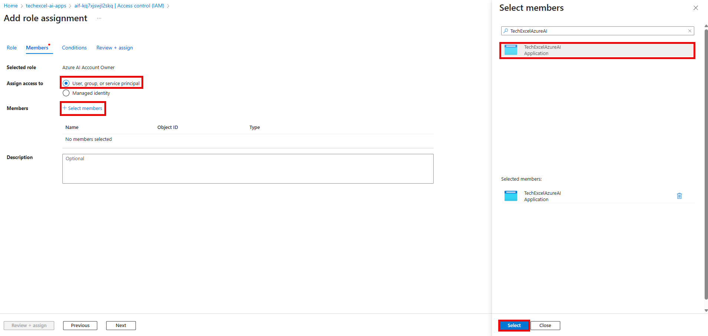

# Task 02 - Automate deployment of Azure AI Foundry agents

## Introduction

So far in this training, you have manually deployed the agents to Azure AI Foundry using the Azure portal one time. In reality, you will likely need to make changes to the agents over time, such as updating the prompts or adding new tools. For this reason, it can be important to automate this deployment process so that you can easily make changes and redeploy the agents as needed.

## Description

In this task, you will create a GitHub Actions workflow that automates the deployment of your Azure AI Foundry agents. The workflow will be triggered on changes to the agent configuration files in your repository. It will use the Azure CLI to check if the agent already exists, and if it does, it will update the existing agent instead of creating a new one. The workflow will also read the necessary secrets from the GitHub repository to authenticate with Azure.

## Success Criteria

- You have updated the agent initializers to check if the agent exists before creating it.
- You have created a GitHub Actions workflow that deploys or updates the agents based on changes to prompts, initializers, or tool files.
- You have successfully deployed an agent change using the GitHub Actions workflow.

## Learning Resources

- [CI/CD for Azure AI Foundry "AI Agent Service" Agents](https://learn.microsoft.com/answers/questions/2279558/ci-cd-for-azure-ai-foundry-ai-agent-service-agents)

## Key Tasks

### 01: Update initializers

The agent initializers that you created in Exercise 02 were written in such a way that they would always create a new agent when run. This is not ideal for a CI/CD pipeline, as you would end up with multiple agents if you made changes and redeployed. Instead, you need to update the initializers to check if the agent already exists, and if it does, update the existing agent instead of creating a new one.

<details markdown="block">
<summary><strong>Expand this section to view the solution</strong></summary>

Begin by opening the `shopperAgent_initializer.py` file in the `src/src/agents` directory. The relevant section of the file is shown below:

```python
with project_client:
    agent = project_client.agents.create_agent(
        model=os.environ["AZURE_AI_AGENT_MODEL_DEPLOYMENT_NAME"],  # Model deployment name
        name="Cora",  # Name of the agent
        instructions=CORA_PROMPT,  # Instructions for the agent
        # toolset=toolset
    )
    print(f"Created agent, ID: {agent.id}")
```

This code calls `project_client.agents.create_agent`, which will always create a new agent with a new Agent ID. Instead, you will retrieve the appropriate agent ID from the `.env` file. Add the following code below the `project_endpoint = os.environ["AZURE_AI_AGENT_ENDPOINT"]` line:

```python
agent_id = os.environ["cora"]
```

Then, if the agent ID variable is set, you will call `project_client.agents.get_agent` to retrieve the existing agent. If the agent ID variable is not set, you will create a new agent as before. Update the code inside the `with project_client:` block to look like this:

```python
with project_client:
    agent_exists = False
    if agent_id:
        # Check if agent exists.
        agent = project_client.agents.get_agent(agent_id)
        print(f"Retrieved existing agent, ID: {agent.id}")
        agent_exists = True
    
    if agent_exists:
        agent = project_client.agents.update_agent(
            agent_id=agent.id,
            model=os.environ["AZURE_AI_AGENT_MODEL_DEPLOYMENT_NAME"],  # Model deployment name
            name="Cora",  # Name of the agent
            instructions=CORA_PROMPT,  # Updated instructions for the agent
            # toolset=toolset
        )
        print(f"Updated agent, ID: {agent.id}")
    else:
        agent = project_client.agents.create_agent(
            model=os.environ["AZURE_AI_AGENT_MODEL_DEPLOYMENT_NAME"],  # Model deployment name
            name="Cora",  # Name of the agent
            instructions=CORA_PROMPT,  # Instructions for the agent
            # toolset=toolset
        )
        print(f"Created agent, ID: {agent.id}")
```

This block checks to see if an agent exists based on the ID from the `.env` file. If it does, it updates the agent using `project_client.agents.update_agent()`. If it does not exist, it creates a new agent as before.

Then, change the prompt in `src/prompts/ShopperAgentPrompt.txt` to add a new guideline or instruction. This will allow you to check that the update functionality is working as expected.

Repeat this process for the other three initializers: add an environment variable reference to retrieve the agent ID, check if the agent exists, and update it if it does.

</details>

- Create workflow for each agent and check if prompt file, initializer, or tool file(s) change, then trigger execution of initializer in workflow
- Read secrets from ENV: AZURE_AI_AGENT_MODEL_DEPLOYMENT_NAME, AZURE_AI_AGENT_ENDPOINT. Also read relevant agent IDs because we'll need them for get_agent call.
- Need to do something with managed identity or client secret? Using DefaultAzureCredential here, so how to work on build server?

### 02: Create a service principal

Create a new service principal named `TechExcelAzureAI` using the following command in the az CLI, being sure to replace `{SUB_ID}` and `{RG}` with your subscription ID and resource group, respectively:

```cmd
az ad sp create-for-rbac --name "TechExcelAzureAI" --json-auth --role contributor --scopes /subscriptions/{SUB_ID}/resourceGroups/{RG}
```

### 03: Create GitHub Actions secret

Create the following GitHub Actions secret:

  1. `AZURE_CREDENTIALS` -- Paste in the entirety of the JSON output from running `az ad sp create-for-rbac`.

<details markdown="block">
<summary><strong>Expand this section to view the solution</strong></summary>

To create a GitHub Actions secret, navigate to your forked GitHub repository and select the **Settings** menu. From there, navigate to **Secrets and variables** and select the **Actions** menu. You can then create new repository secrets.



</details>

### 04: Grant the service principal access to Azure AI Foundry

Next, you will need to grant the service principal access to your Azure AI Foundry instance. Specifically, the `TechExcelAzureAI` service principal will need to be assigned the `Azure AI User` role for your Azure AI Foundry resource. This will allow your GitHub Actions workflow to use the service principal to create and manage agents within Azure AI Foundry.

<details markdown="block">
<summary><strong>Expand this section to view the solution</strong></summary>

Navigate to the [Azure portal](https://portal.azure.com/) and open your Azure AI Foundry resource.



From there, navigate to **Access control (IAM)** from the left-hand menu. Select the **+ Add** button and then choose the **Add role assignment** option.


In the **Role** dropdown, select the **Azure AI User** role. Then, select the **Members** tab.


On the **Add role assignment** page, select the **User, group, or service principal** radio button and then select **+ Select members**. In the **Select members** pane, search for `TechExcelAzureAI` and select it from the list. After that, select the **Select** button at the bottom of the pane.



Finally, select **Review + assign** twice to grant the Azure AI User role to your service principal.

</details>

### 05: Create workflow for each agent

The next step is to create a workflow for each agent. This workflow will check if the prompt file, initializer, or tool file(s) have changed, and if they have, it will trigger the execution of the initializer in the workflow. You will create a separate workflow file for each agent in the `.github/workflows` directory of your repository because each agent has its own initializer and prompt file, and you want to be able to deploy them independently.

Use GitHub Copilot to assist you in writing the GitHub Actions workflow files. The workflow should be triggered on changes to the relevant files for each agent. It should use the Azure CLI to authenticate with Azure and run the initializer script for the agent.

You might wish to use a prompt such as the following as a starting point for GitHub Copilot:

```plaintext
Please generate a GitHub Actions workflow that executes the python code in src/src/agents/customerLoyaltyAgent_initializer.py if that file changes or if the src/prompts/CustomerLoyaltyAgentPrompt.txt file changes. It also makes use of a tool located in src/src/tools/discountLogic.py, so any changes there must also trigger the workflow. The Python script needs to be able to connect to Azure using the azure.ai.projects package.
```

If you are unable to get a satisfactory response from GitHub Copilot or wish to compare your results to a working example, you can use the following example workflow as a starting point. Make sure to adjust the values for your specific environment.

<details markdown="block">
<summary><strong>Expand this section to view the solution if you are not able to get a satisfactory response from GitHub Copilot</strong></summary>

This example workflow is for the Customer Loyalty agent. You will need to create similar workflows for the other agents, adjusting the file paths and environment variables as needed.

```yaml
name: Deploy Customer Loyalty Agent

on:
  push:
    # Paths include the initializer, prompt, workflow, and any associated tools
    paths:
      - 'src/src/agents/customerLoyaltyAgent_initializer.py'
      - 'src/src/tools/discountLogic.py'
      - 'src/prompts/CustomerLoyaltyAgentPrompt.txt'
      - '.github/workflows/deploy-customer-loyalty-agent.yml'
  # Allows you to run this workflow manually from the Actions tab
  workflow_dispatch:

jobs:
  run-customer-loyalty-agent:
    runs-on: ubuntu-latest
    steps:
      - name: Checkout repository
        uses: actions/checkout@v4

      - name: Create .env file from secret
        run: 'echo "$ENV" > src/.env'
        shell: bash
        env:
          ENV: ${{ secrets.ENV }}

      - name: Set up Python
        uses: actions/setup-python@v5
        with:
          python-version: '3.12'

      - name: Install dependencies
        run: |
          python -m pip install --upgrade pip
          pip install -r src/requirements.txt

      - name: Login via Azure CLI
        uses: azure/login@v2.1.1
        with:
            creds: ${{ secrets.AZURE_CREDENTIALS }}

      - name: Run customer loyalty agent initializer
        run: |
          cd src/
          python src/agents/customerLoyaltyAgent_initializer.py
```

</details>

Repeat this process for the other three workflows, including details on their initializers, prompts, and (when applicable) tools.

### 06: Perform and verify the deployment

Once the workflows are in place, you can trigger them (assuming you have a `workflow_dispatch` trigger) or make a small change to one of the relevant files to trigger the workflow. You can then monitor the progress of the workflow in the **Actions** tab of your GitHub repository.


